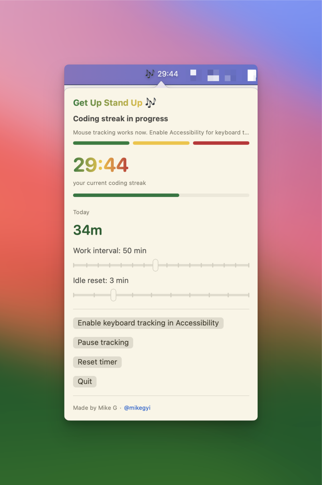

# Get Up Stand Up

Minimal macOS menu bar app that tracks your coding streak and nudges you to stand up before you get welded to your chair.

Made by [Mike G](https://x.com/mikegyi).

<p align="center">
  
</p>

## What it does

- Tracks keyboard, mouse, scroll, and general desktop activity
- Shows a live count-up timer in the menu bar
- Resets the streak if you go idle for a few minutes
- Switches from `🎶` to `💿` when you hit the break threshold
- Sends a macOS notification when it is time to stand up
- Lives in the menu bar instead of the Dock

## Download

Download the latest build from [GitHub Releases](https://github.com/mikegyi/get-up-stand-up/releases/latest).

## Run from source

```bash
git clone https://github.com/mikegyi/get-up-stand-up.git
cd get-up-stand-up
swift run
```

## Install locally

```bash
./scripts/install-app.sh
open "$HOME/Applications/Stand Up.app"
```

## Launch at login

```bash
./scripts/install-launch-agent.sh
```

## Build a release zip

```bash
./scripts/package-release.sh
```

This creates a zip in `release/` that can be uploaded to GitHub Releases.

## Permissions

On first run, macOS may ask for:

- Notifications permission
- Accessibility permission for global keyboard tracking

If the timer is not reacting to activity, open:

`System Settings -> Privacy & Security`

Then allow the app under Accessibility.
